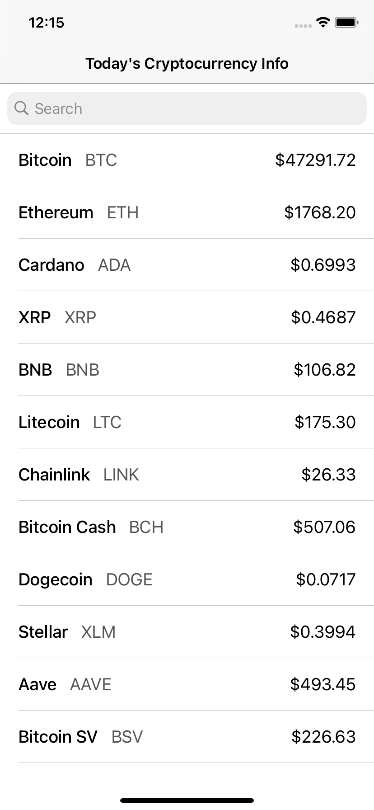
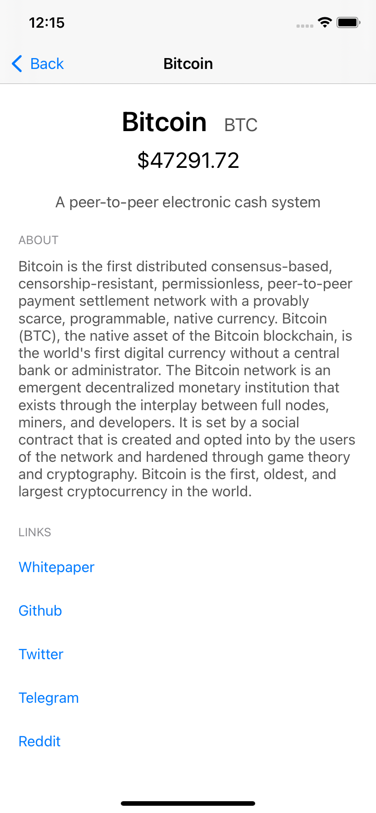
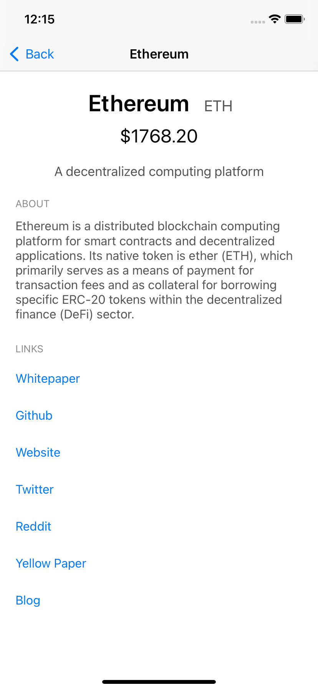
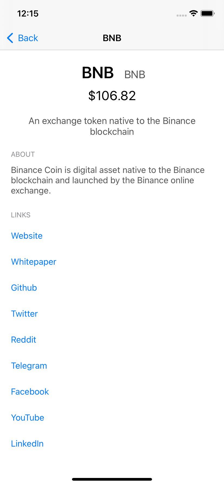

# Cryptocurrency Info
[](https://swift.org)
[](https://developer.apple.com/swift/)
[](https://github.com/denissimon/Cryptocurrency-Info/blob/master/LICENSE)

Example iOS app designed using MVVM-C and Layered Architecture. Uses Swift Concurrency.

The app shows cryptocurrency prices and other related info. Built with Messari API.

It has two modules: AssetsList and AssetDetails. The list of cryptocurrencies is loaded in batches.

<table> 
  <tr>
    <td> </td>
    <td> </td>
    <td> </td>
    <td> </td>
  </tr>
</table>

### Architecture concepts used here

- [Layered Architecture][LayeredArchitectureLink]
- [MVVM][MVVMLink]
- [Flow coordinator][FlowCoordinatorLink]
- [Dependency Injection][DIContainerLink], DIContainer
- [Data Binding][DataBindingLink] using the lightweight Observable\<T\>
- [Closure-based delegation][ClosureBasedDelegationLink] using the lightweight Event\<T\>
- [Reusable data sources][DataSourceLink]

[LayeredArchitectureLink]: https://en.wikipedia.org/wiki/Multitier_architecture
[MVVMLink]: https://github.com/denissimon/Cryptocurrency-Info/tree/master/CryptocurrencyInfo/Modules/AssetsFeature/AssetDetails
[FlowCoordinatorLink]: https://github.com/denissimon/Cryptocurrency-Info/tree/master/CryptocurrencyInfo/Coordinator
[DIContainerLink]: https://github.com/denissimon/Cryptocurrency-Info/blob/master/CryptocurrencyInfo/Coordinator/DIContainer/DIContainer.swift
[DataBindingLink]: https://github.com/denissimon/Cryptocurrency-Info/blob/master/CryptocurrencyInfo/Modules/AssetsFeature/AssetsList/ViewModel/AssetsListViewModel.swift
[ClosureBasedDelegationLink]: https://github.com/denissimon/Cryptocurrency-Info/blob/master/CryptocurrencyInfo/Modules/AssetsFeature/AssetsList/View/AssetsListDataSource.swift
[DataSourceLink]: https://github.com/denissimon/Cryptocurrency-Info/blob/master/CryptocurrencyInfo/Modules/AssetsFeature/AssetDetails/View/AssetDetailsDataSource.swift

### Includes

- [async/await][AsyncAwaitLink] with the existing Infrastructure remaining unchanged
- [Shared events service][SharedEventsLink]
- Advanced using of [Codable][CodableLink]
- Localization
- Unit tests

[AsyncAwaitLink]: https://github.com/denissimon/Cryptocurrency-Info/tree/master/CryptocurrencyInfo/Data/Repositories
[SharedEventsLink]: https://github.com/denissimon/Cryptocurrency-Info/blob/master/CryptocurrencyInfo/Services/SharedEvents.swift
[CodableLink]: https://github.com/denissimon/Cryptocurrency-Info/blob/master/CryptocurrencyInfo/Modules/AssetsFeature/AssetDetails/Models/Profile.swift

### Built with

- [SwiftEvents](https://github.com/denissimon/SwiftEvents) - The easiest way to implement data binding and notifications. Includes Event\<T\> and Observable\<T\>. Has a thread-safe version.
- [URLSessionAdapter](https://github.com/denissimon/URLSessionAdapter) - A Codable wrapper around URLSession for networking.
- [Toast-Swift](https://github.com/scalessec/Toast-Swift) - A Swift extension that adds toast notifications to the UIView object class.
- [UAObfuscatedString](https://github.com/UrbanApps/UAObfuscatedString) - A simple category to hide sensitive strings from appearing in your binary.

The dependency manager is [Swift Package Manager](https://www.swift.org/documentation/package-manager/). To update package versions: 

```txt
Xcode: File -> Packages -> Update to Latest Package Versions
```

### Requirements

iOS version support: 15.0+. Xcode 13.0+, Swift 5.5+
